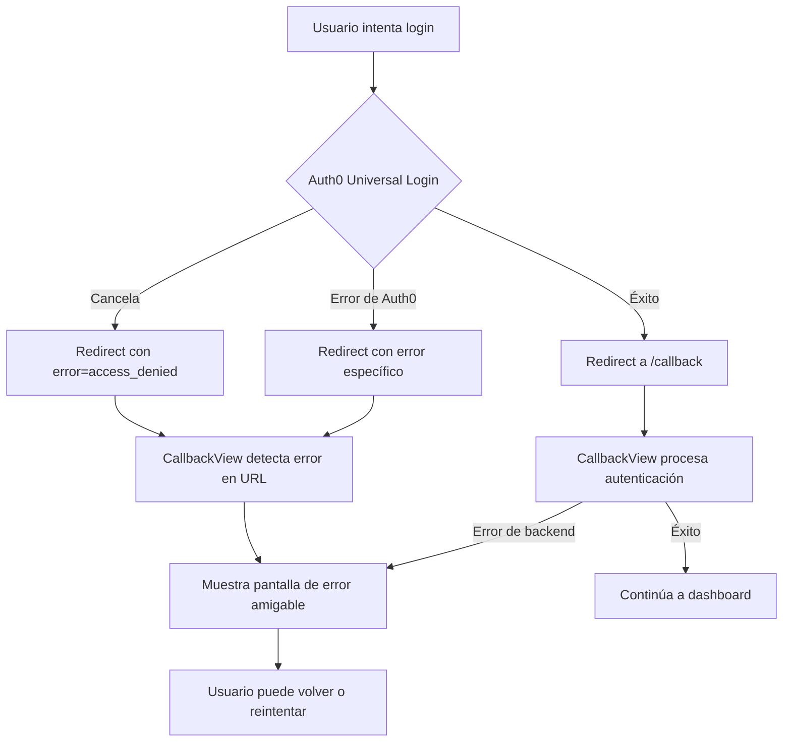

# Manejo de Errores de Auth0

## Descripción

Este documento describe cómo la aplicación maneja los errores de autenticación de Auth0, especialmente cuando un usuario cancela el proceso de login/registro.

## Errores Comunes de Auth0

### 1. `access_denied`
**Causa:** El usuario canceló el login, cerró la ventana de Auth0, o Auth0 negó el acceso.

**Mensaje al usuario:**
- Si contiene "cancelled" o "closed popup": *"Cancelaste el inicio de sesión. Puedes intentarlo nuevamente cuando lo desees."*
- Otros casos: *"Acceso denegado. Por favor, verifica tus credenciales e intenta nuevamente."*

### 2. `unauthorized`
**Causa:** El usuario no tiene autorización para acceder.

**Mensaje al usuario:** *"No tienes autorización para acceder. Por favor, contacta al administrador."*

### 3. `server_error`
**Causa:** Error interno en el servidor de Auth0.

**Mensaje al usuario:** *"Error en el servidor de autenticación. Por favor, intenta más tarde."*

### 4. `temporarily_unavailable`
**Causa:** El servicio de Auth0 no está disponible temporalmente.

**Mensaje al usuario:** *"El servicio de autenticación no está disponible temporalmente. Intenta más tarde."*

## Implementación

### CallbackView.tsx

El componente `CallbackView` maneja los errores de Auth0 en tres niveles:

#### 1. Errores en URL (Query Parameters)
```typescript
const urlError = searchParams.get('error');
const urlErrorDescription = searchParams.get('error_description');
```

Auth0 redirige con parámetros como:
- `?error=access_denied&error_description=User%20cancelled`

#### 2. Errores del Hook de Auth0
```typescript
const { error: auth0Error } = useAuth0();
```

El hook puede reportar errores directamente.

#### 3. Errores de Backend
```typescript
catch (err: any) {
  setError(err.message || "Error al conectar con el servidor...");
}
```

Errores durante el proceso de registro/login con el backend.

## Flujo de Manejo de Errores



## Pantalla de Error

Cuando se detecta un error, se muestra:

1. **Icono de advertencia** (⚠️)
2. **Título dinámico:**
   - "Inicio de sesión cancelado" si el usuario canceló
   - "Error al iniciar sesión" para otros errores
3. **Mensaje descriptivo** según el tipo de error
4. **Dos botones:**
   - **"Volver al inicio"** → Navega a `/landing`
   - **"Intentar nuevamente"** → Recarga la página para reintentar

## Prevención de Falsos Positivos

### Problema Original
El `CallbackView` intentaba autenticar al usuario incluso cuando había cancelado, causando:
- Llamadas innecesarias al backend
- Mensajes de error confusos
- Registros de usuarios sin completar

### Solución Implementada

1. **Verificación temprana de errores:**
```typescript
useEffect(() => {
  const urlError = searchParams.get('error');
  if (urlError) {
    setError(userFriendlyMessage);
    return; // Detener ejecución
  }
}, [searchParams]);
```

2. **Guard clause en el callback:**
```typescript
const handleAuthCallback = async () => {
  if (error) {
    console.log('⚠️ No se procesa callback porque hay un error activo');
    return;
  }
  // ... resto del código
};
```

3. **Incluir error en dependencias:**
```typescript
}, [isAuthenticated, isLoading, user, getAccessTokenSilently, navigate, registering, error]);
```

## Configuración de Auth0 Provider

En `main.tsx`, el `Auth0Provider` está configurado con:

```typescript
<Auth0Provider
  domain={...}
  clientId={...}
  authorizationParams={{
    redirect_uri: import.meta.env.VITE_AUTH0_CALLBACK_URL,
    audience: import.meta.env.VITE_AUTH0_AUDIENCE,
    scope: "openid profile email",
  }}
  onRedirectCallback={(appState) => {
    console.log('🔄 [Auth0] onRedirectCallback ejecutado:', appState);
  }}
  useRefreshTokens={true}
  cacheLocation="localstorage"
/>
```

- **`useRefreshTokens`**: Permite renovar tokens sin re-autenticación
- **`cacheLocation`**: Persiste la sesión en localStorage
- **`onRedirectCallback`**: Log para debugging

## Testing

### Escenarios a Probar

1. **Usuario cancela el login:**
   - Abrir Auth0 Universal Login
   - Hacer clic en "X" o cancelar
   - Verificar: Mensaje "Cancelaste el inicio de sesión"

2. **Credenciales incorrectas:**
   - Ingresar email/password incorrectos
   - Verificar: Mensaje de error apropiado

3. **Error de red:**
   - Desconectar internet durante el login
   - Verificar: Mensaje de error de servidor

4. **Login exitoso:**
   - Completar login correctamente
   - Verificar: Redirección a dashboard sin errores

## Logs de Consola

El sistema incluye logs detallados:

```
🚨 [CallbackView] Error de Auth0 detectado en URL: { error: 'access_denied', description: 'User cancelled' }
❌ [CallbackView] Mostrando mensaje de error al usuario: Cancelaste el inicio de sesión...
⚠️ [CallbackView] No se procesa callback porque hay un error activo
```

Estos logs ayudan a diagnosticar problemas en desarrollo y producción.

## Mejoras Futuras

1. **Tracking de errores:**
   - Integrar con servicio como Sentry
   - Enviar métricas de errores de Auth0

2. **Retry automático:**
   - Para errores temporales (`temporarily_unavailable`)
   - Con backoff exponencial

3. **Mensajes personalizados:**
   - Según el contexto (primera vez vs. reintento)
   - Sugerencias específicas por tipo de error

## Referencias

- [Auth0 Error Codes](https://auth0.com/docs/troubleshoot/customer-support/error-codes)
- [Auth0 React SDK](https://auth0.com/docs/libraries/auth0-react)
- [OAuth 2.0 Error Responses](https://tools.ietf.org/html/rfc6749#section-4.1.2.1)
